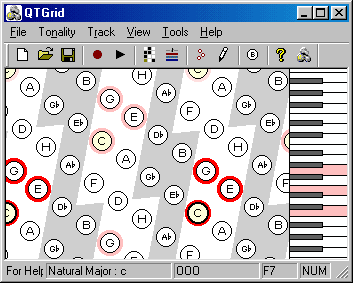
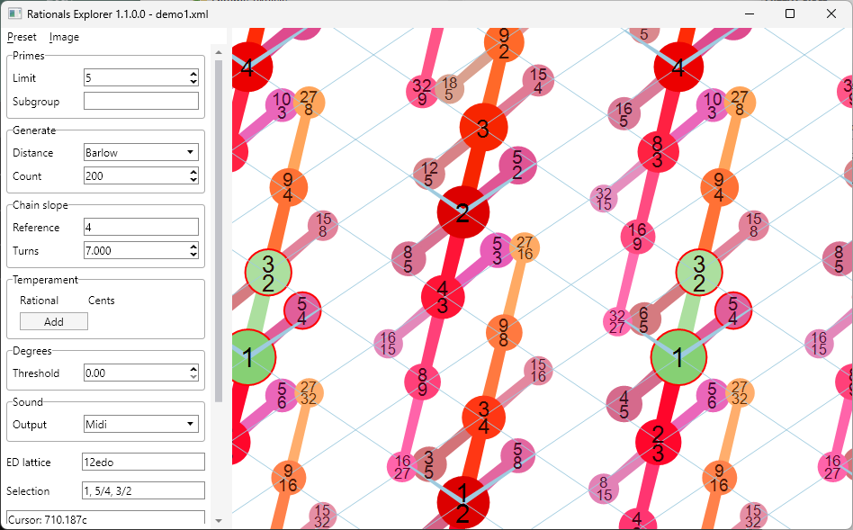
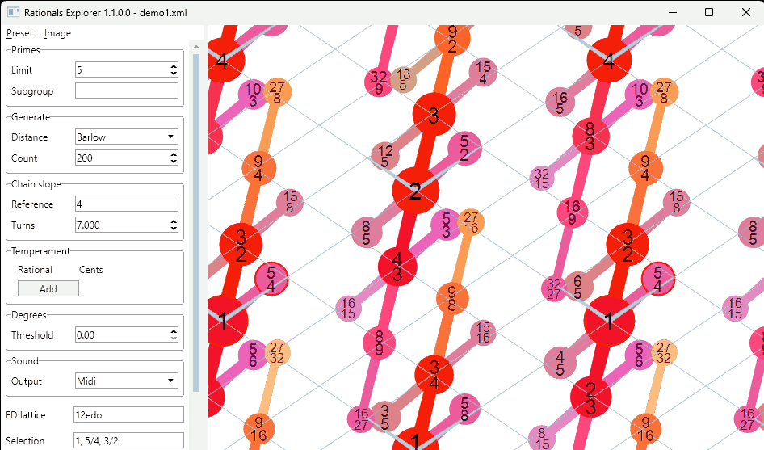
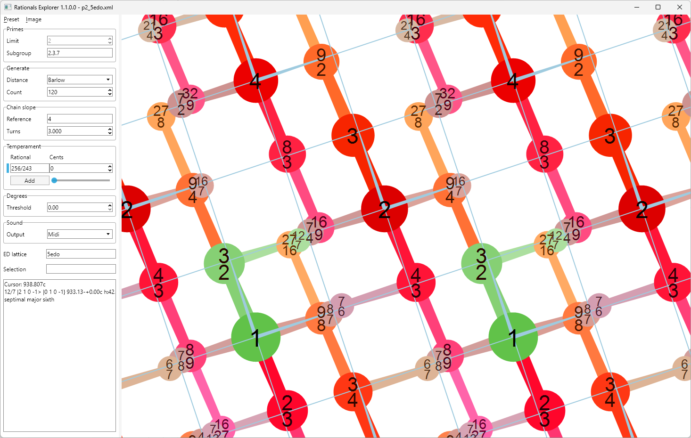
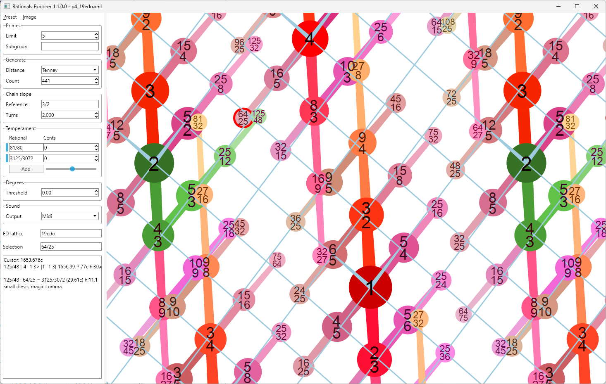
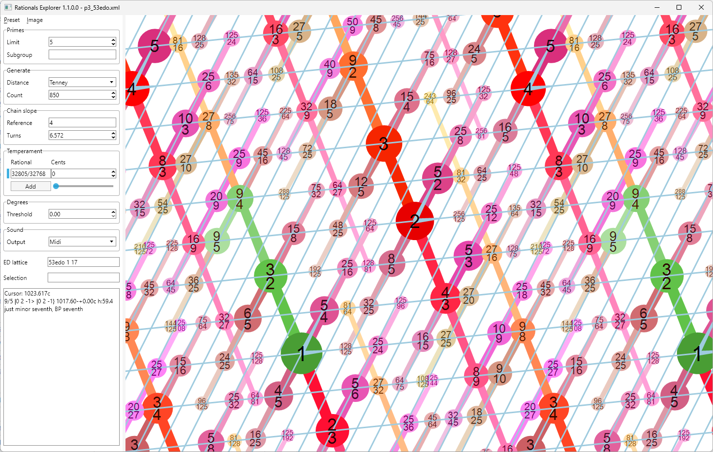
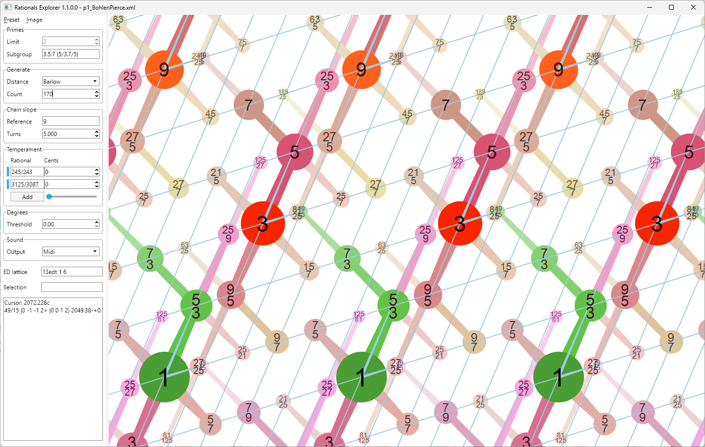

# Rationals Explorer
*Just intonation and temperament visualization tool*

## Introduction

Rationals Explorer is a continuation of my earlier project, [**QTGrid**](https://bntr.planet.ee/wiki/?id=qtgrid) (2003), which in turn was inspired by Simon Holland’s work on *Harmony Space* (e.g. [Learning about harmony with Harmony Space: an overview](https://oro.open.ac.uk/59664/1/Hsp%20Music%20AI%20ED.pdf), 1993).

At its core, QTGrid implemented an *isomorphic keyboard* — a uniform 2D grid where moving upward corresponded to a perfect fifth, and moving diagonally up-right represented a major third. One of its strengths was that pitch consistently aligned with the vertical (Y) coordinate, making it possible to horizontally project all notes onto a standard piano keyboard placed on the right side of the screen. This allowed melodic relationships to be interpreted horizontally and harmonic ones vertically.

**Rationals Explorer** was developed during a period of interest in *Just Intonation*. Like QTGrid, it features an isomorphic keyboard — but with a key difference: it is also an *enharmonic keyboard*. This means that the note structure does not loop back enharmonically, allowing for the clear representation of pure intervals and microtones.

## Disclaimer

The terminology used in this project may differ from or disregard standard conventions (such as those found on [xen.wiki](https://xen.wiki/)). For example:

- The first basis element of a subgroup I call the *subgroup base*.
- The term *narrow* is used here to describe an interval that is compressed using the base interval of the subgroup — applied in the denominator of a ratio (e.g. narrowing 5/1 to 5/4 using the octave, similar in concept to octave equivalence).

I hold a view that is probably not the most widespread — that, during music perception, the brain tends to rationalize tones — a process sometimes referred to as *aural correction* — even if the actual tuning is tempered or impure.
Aural correction has been discussed by theorists such as Ю. Н. Тюлин (Учение о гармонии) and Ю. Холопов (Гармония. Теоретический курс).

As such, **Rationals Explorer** aims to reflect the harmonic organization of tones as imagined by the listener — or as intended by the composer or performer — even if the actual tuning or intonation differs from it.

This project was primarily developed between 2018 and 2020. It is being published now simply to preserve and share what I believe to be a successful approach to visualizing harmonic space.

Further development is unlikely, but if anyone is interested — feel free to fork it.

## Grid Structure

The visual representation aims to project a multidimensional grid of harmonic space onto the screen. The number of dimensions depends on the chosen Just Intonation level or specific subgroup. Lines and colors are used to express the harmonic structure.

For the selected JI limit (or custom subgroup), the grid is populated with a specified number of rational numbers (pitches) that are harmonically closest to 1. The closeness is determined using a user-selected harmonic distance function, such as:

- **Barlow** – Indigestibility by Clarence Barlow (1978). See: [On the Quantification of Harmony and Metre](https://www.mat.ucsb.edu/Publications/Quantification_of_Harmony_and_Metre.pdf)  
  (Formula taken from Albert Gräf’s [Musical Scale Rationalization – A Graph-Theoretic Approach](https://www.musikinformatik.uni-mainz.de/schriftenreihe/nr45/scale.pdf), 2002)

- **Euler** – Gradus Suavitatis by Leonhard Euler (formula also from Gräf, 2002)

- **Tenney** – Harmonic Distance by James Tenney. See: [John Cage and the Theory of Harmony](https://www.plainsound.org/pdfs/JC&ToH.pdf)   (1983)  

Each pitch is displayed as a circle whose radius and color reflect its harmonic closeness to 1.

The pattern repeats horizontally at a user-defined spacing. Pitches are connected with lines in a tree-like structure to highlight harmonic relationships. To reduce clutter, the grid basis uses *narrowed* intervals — for instance, 5/4 instead of 5/1. Lines are not drawn along the main subgroup interval (e.g., the octave).

For example, with JI Level 5 (i.e., subgroup 2.3.5 and octave as the base interval), the grid basis is {-, 3/2, 5/4}.  
(Visual: vectors for 3/2 and 5/4)

The GUI allows users to scale and stretch the grid independently in vertical and horizontal directions and to adjust the size of the pitch circles.

When pitches are ordered by pitch height, they form a chain that gently ascends to the right. The slope of this chain can be controlled by specifying the number of *turns* required to reach a reference interval.

It is also possible to overlay a lattice representing equal temperament on the grid.

Rationals Explorer includes temperament features that allow the user to visualize how pitches are altered through tempering — for example, how specific commas are tempered out.

## Examples
This section presents several examples that demonstrate the visualization of various Just Intonation subgroups and their overlay with Equal Temperament lattices.

### 5 EDO
Subgroup 2.3.7 (drawer basis: 3/2.9/8), 5edo lattice

### 19 EDO
Subgroup 2.3.5 (drawer basis: 3/2.5/4), 19edo lattice

### 53 EDO
Subgroup 2.3.5 (drawer basis: 3/2.5/4), 53edo lattice (basis: 1 17)

### Bohlen–Pierce scale
Subgroup 3.5.7 (drawer basis: 5/3.7/5), 13edt lattice (basis: 1 6)

## GUI

### Sidebar

**Primes**
- **Limit** – Just Intonation limit prime (e.g. 3, 5, ...)
- **Subgroup** – A custom JI subgroup (overrides Limit), e.g. "2.3.7" or "2.5/3.7"

**Generate**
- **Distance** – Harmonic distance function (Barlow, Euler, Tenney)
- **Count** – Number of rational pitches to generate

**Chain slope**
- **Reference** – A reference ratio (e.g. 3/2)
- **Turns** – Number of turns the chain takes to reach the reference

**Temperament**
- Left vertical bar – Selects rows for deletion or reordering
- **Rational** – e.g. 256/243 or monzo [8 -5>
- **Cents** – Tempered value in cents (0 means tempered out)
- **Add** – Adds an interval to the temperament
- **Slider** – Global temperament measure; applies the temperament to the grid

**Degrees**
- **Threshold** – Degree threshold in cents. If set, notes closer than this value merge into a degree (marked yellow)

**Sound**
- **Mode** – Sound generation mode: MIDI, Wave, or WavePartialsTempered
  - *WavePartialsTempered* filters and tempers partials according to current settings (partial heights are shown as green horizontal lines)

**ED lattice**
- Equal division lattices, e.g. "12edo", "19ed3", "12ed2 4 7" (last numbers define basis degrees)

**Selection**
- Shows selected rationals

**Cursor & Info Box**
- Displays data about the currently highlighted pitch (ratio, monzo, narrow coefficients, cents, harmonicity)
- Also shows interval relations to selected notes

*Note: Rationals can be entered as fractions (e.g. '3/2') or in monzo notation ('[8 -5>')*

### Menu

**Preset** – Save, open, or reset sidebar and view settings  
**Image** – Save current view as PNG or SVG, or open SVG in the default app

### Mouse Controls

- **Wheel** – Vertical scroll
- **Ctrl + Wheel** – Zoom
- **Shift + Wheel** – Stretch zoom
- **Alt + Wheel** – Scale notes
- **Mouse move** – Highlight pitch (green path shown)
- **Left-click** – Play highlighted pitch
- **Ctrl + Left-click** – Add/remove note from selection
- **Middle-drag** – Pan the grid
- **Shift + Mouse move** – Lock highlight
- **Alt + Mouse move** – Highlight a custom pitch (outside the grid)
- **Alt + Left-click** – Play custom pitch

## Technical Notes

Rationals Explorer is written in **C#**, using the **Avalonia UI framework**. It targets **.NET 8** and uses **Avalonia 0.10**. The application has been successfully built and run on Windows, Debian, and WSL (with `libSkiaSharp` and `libgdiplus`).

### Dependencies

- [**Avalonia**](https://github.com/AvaloniaUI/Avalonia) – MIT License
- [**managed-midi**](https://github.com/atsushieno/managed-midi) – MIT License
- [**SharpAudio**](https://github.com/feliwir/SharpAudio) – MIT License

### Interval Names

Interval names used in the program are taken from the [**List of Intervals**](https://www.huygens-fokker.org/docs/intervals.html) compiled by Manuel Op de Coul, published by the Huygens-Fokker Foundation.
